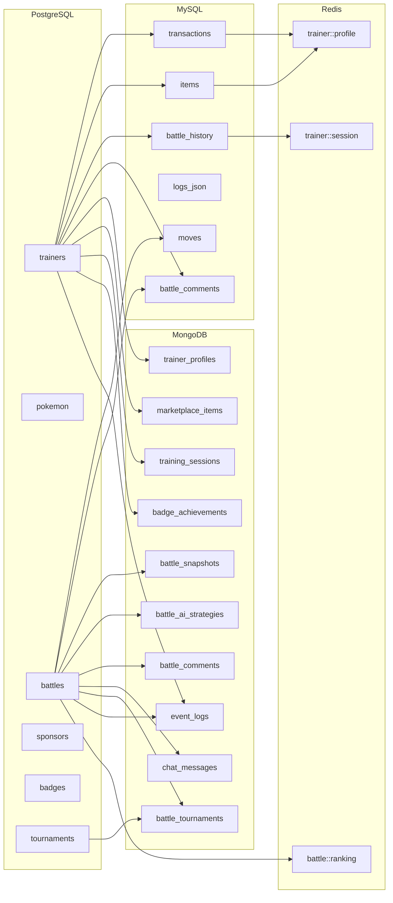

```mermaid
flowchart LR

%% PostgreSQL
subgraph PostgreSQL
    P1[trainers]
    P2[pokemon]
    P3[battles]
    P4[sponsors]
    P5[badges]
    P6[tournaments]
end

%% MySQL
subgraph MySQL
    M1[transactions]
    M2[items]
    M3[battle_history]
    M4[logs_json]
    M5[moves]
    M6[battle_comments]
end

%% MongoDB
subgraph MongoDB
    N1[battle_snapshots]
    N2[trainer_profiles]
    N3[marketplace_items]
    N4[training_sessions]
    N5[battle_ai_strategies]
    N6[battle_comments]
    N7[battle_tournaments]
    N8[chat_messages]
    N9[badge_achievements]
    N10[event_logs]
end

%% Redis
subgraph Redis
    R1[trainer:<id>:profile]
    R2[battle:<id>:ranking]
    R3[trainer:<id>:session]
end

%% Relaciones PostgreSQL -> MySQL
P1 --> M1
P1 --> M2
P1 --> M3
P1 --> M6
P3 --> M5
P3 --> M6

%% Relaciones PostgreSQL -> MongoDB
P1 --> N2
P1 --> N3
P1 --> N4
P1 --> N9
P3 --> N1
P3 --> N5
P3 --> N6
P3 --> N8
P3 --> N7
P6 --> N7
P1 --> N10
P3 --> N10

%% Relaciones MySQL -> Redis
M1 --> R1
M2 --> R1
M3 --> R3

%% Relaciones PostgreSQL -> Redis
P3 --> R2


```