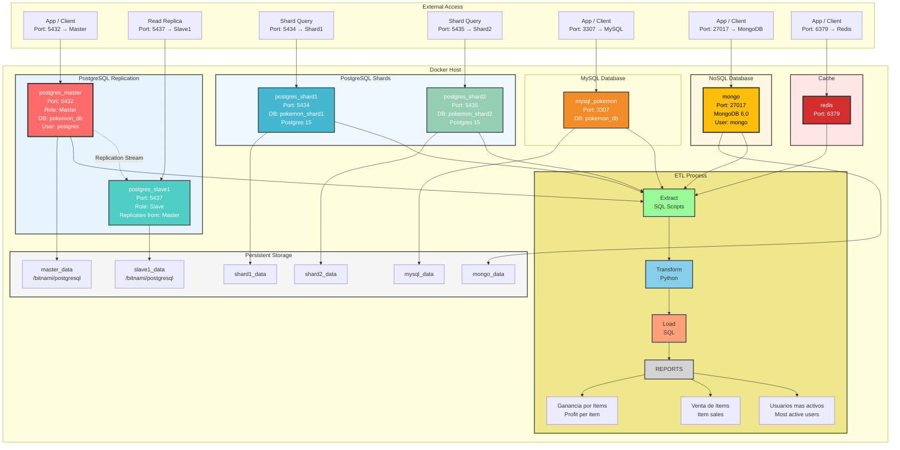

```mermaid
flowchart TD
    subgraph DockerHost["Docker Host"]

        subgraph PostgreSQL_Replication["PostgreSQL Replication"]
            Master["postgres_master<br>Port: 5432<br>Role: Master<br>DB: pokemon_db<br>User: postgres"]
            Slave1["postgres_slave1<br>Port: 5437<br>Role: Slave<br>Replicates from: Master"]

            Master -.->|"Replication Stream"| Slave1
        end

        subgraph PostgreSQL_Shards["PostgreSQL Shards"]
            Shard1["postgres_shard1<br>Port: 5434<br>DB: pokemon_shard1<br>Postgres 15"]
            Shard2["postgres_shard2<br>Port: 5435<br>DB: pokemon_shard2<br>Postgres 15"]
        end

        %% Cambié el nombre del subgrafo para evitar conflicto con el nodo MySQL
        subgraph MySQL_DB["MySQL Database"]
            MySQL["mysql_pokemon<br>Port: 3307<br>DB: pokemon_db"]
        end

        subgraph NoSQL["NoSQL Database"]
            MongoDB["mongo<br>Port: 27017<br>MongoDB 6.0<br>User: mongo"]
        end

        subgraph Cache["Cache"]
            Redis["redis<br>Port: 6379"]
        end

        subgraph Volumes["Persistent Storage"]
            MasterVol["master_data<br>/bitnami/postgresql"]
            SlaveVol["slave1_data<br>/bitnami/postgresql"]
            Shard1Vol["shard1_data"]
            Shard2Vol["shard2_data"]
            MySQLVol["mysql_data"]
            MongoVol["mongo_data"]
        end

        subgraph ETL_Process["ETL Process"]
            Extract["Extract\nSQL Scripts"]
            Transform["Transform\nPython"]
            Load["Load\nSQL"]

            Extract --> Transform --> Load
            Master --> Extract
            Shard1 --> Extract
            Shard2 --> Extract
            MySQL --> Extract
            MongoDB --> Extract
            Redis --> Extract

            Load --> Reports["REPORTS"]
            Reports --> R2[Usuarios mas activos\nMost active users]
            Reports --> R5[Venta de Items\nItem sales]
            Reports --> R6[Ganancia por Items\nProfit per item]
        end
    end

    %% Relaciones con volúmenes
    Master --> MasterVol
    Slave1 --> SlaveVol
    Shard1 --> Shard1Vol
    Shard2 --> Shard2Vol
    MySQL --> MySQLVol
    MongoDB --> MongoVol

    %% Relaciones externas (puertos)
    subgraph ExternalAccess["External Access"]
        AppMaster["App / Client\nPort: 5432 → Master"]
        AppSlave1["Read Replica\nPort: 5437 → Slave1"]
        AppShard1["Shard Query\nPort: 5434 → Shard1"]
        AppShard2["Shard Query\nPort: 5435 → Shard2"]
        AppMySQL["App / Client\nPort: 3307 → MySQL"]
        AppMongo["App / Client\nPort: 27017 → MongoDB"]
        AppRedis["App / Client\nPort: 6379 → Redis"]
    end

    AppMaster --> Master
    AppSlave1 --> Slave1
    AppShard1 --> Shard1
    AppShard2 --> Shard2
    AppMySQL --> MySQL
    AppMongo --> MongoDB
    AppRedis --> Redis

    style Master fill:#ff6b6b,stroke:#333,stroke-width:3px,color:#fff
    style Slave1 fill:#4ecdc4,stroke:#333,stroke-width:2px,color:#fff
    style Shard1 fill:#45b7d1,stroke:#333,stroke-width:2px,color:#fff
    style Shard2 fill:#96ceb4,stroke:#333,stroke-width:2px,color:#fff
    style MySQL fill:#f28c28,stroke:#333,stroke-width:2px,color:#fff
    style MongoDB fill:#ffbe0b,stroke:#333,stroke-width:3px,color:#000
    style Redis fill:#d32f2f,stroke:#333,stroke-width:3px,color:#fff
    style PostgreSQL_Replication fill:#e8f4fd,stroke:#333,stroke-width:2px
    style PostgreSQL_Shards fill:#f0f8ff,stroke:#333,stroke-width:2px
    style NoSQL fill:#fff8e1,stroke:#333,stroke-width:2px
    style Cache fill:#ffe5e5,stroke:#333,stroke-width:2px
    style Volumes fill:#f5f5f5,stroke:#333,stroke-width:2px
    style ETL_Process fill:#f0e68c,stroke:#333,stroke-width:2px
    style Extract fill:#98fb98,stroke:#333,stroke-width:2px
    style Transform fill:#87ceeb,stroke:#333,stroke-width:2px
    style Load fill:#ffa07a,stroke:#333,stroke-width:2px
    style Reports fill:#d3d3d3,stroke:#333,stroke-width:2px

```