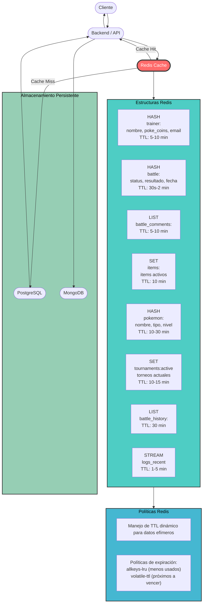

```mermaid
flowchart TD
    Cliente([Cliente])
    API([Backend / API])
    Redis([Redis Cache])
    Postgres([PostgreSQL])
    Mongo([MongoDB])

    Cliente --> API
    API --> Redis
    Redis -- "Cache Hit" --> API
    Redis -- "Cache Miss" --> Postgres
    Postgres --> API
    API --> Cliente
    API --> Mongo

    subgraph RedisStructures["Estructuras Redis"]
        TrainerHash["HASH<br/>trainer:<id><br/>nombre, poke_coins, email<br/>TTL: 5-10 min"]
        BattleHash["HASH<br/>battle:<id><br/>status, resultado, fecha<br/>TTL: 30s-2 min"]
        BattleCommentsList["LIST<br/>battle_comments:<battle_id><br/>TTL: 5-10 min"]
        ItemsSet["SET<br/>items:<trainer_id><br/>items activos<br/>TTL: 10 min"]
        PokemonHash["HASH<br/>pokemon:<id><br/>nombre, tipo, nivel<br/>TTL: 10-30 min"]
        TournamentsSet["SET<br/>tournaments:active<br/>torneos actuales<br/>TTL: 10-15 min"]
        BattleHistoryList["LIST<br/>battle_history:<trainer_id><br/>TTL: 30 min"]
        LogsStream["STREAM<br/>logs_recent<br/>TTL: 1-5 min"]
    end

    subgraph RedisPolicies["Políticas Redis"]
        TTL["Manejo de TTL dinámico para datos efímeros"]
        Eviction["Políticas de expiración:<br/>allkeys-lru (menos usados)<br/>volatile-ttl (próximos a vencer)"]
    end

    subgraph Almacenamiento["Almacenamiento Persistente"]
        Postgres
        Mongo
    end

    Redis --> RedisStructures
    RedisStructures --> RedisPolicies

    style Redis fill:#ff6b6b,stroke:#333,stroke-width:3px,color:#fff
    style RedisStructures fill:#4ecdc4,stroke:#333,stroke-width:2px,color:#000
    style RedisPolicies fill:#45b7d1,stroke:#333,stroke-width:2px,color:#000
    style Almacenamiento fill:#96ceb4,stroke:#333,stroke-width:2px,color:#000
```