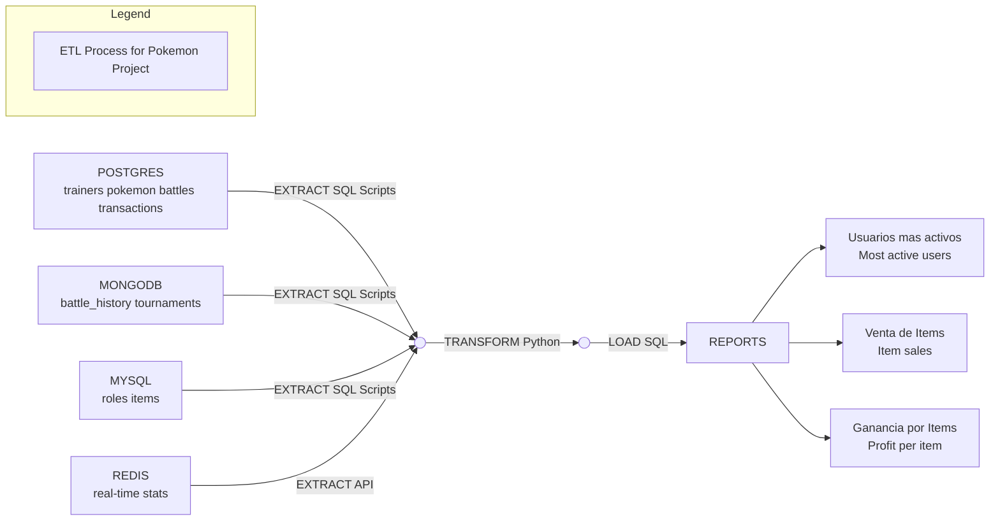

```mermaid
graph LR
    A[POSTGRES\ntrainers pokemon battles transactions] -->|EXTRACT SQL Scripts| B(( ))
    C[MONGODB\nbattle_history tournaments] -->|EXTRACT SQL Scripts| B(( ))
    D[MYSQL\nroles items] -->|EXTRACT SQL Scripts| B(( ))
    E[REDIS\nreal-time stats] -->|EXTRACT API| B(( ))

    B(( )) -->|TRANSFORM Python| F(( ))
    F(( )) -->|LOAD SQL| G[REPORTS]

    G --> I[Usuarios mas activos\nMost active users]
    G --> L[Venta de Items\nItem sales]
    G --> M[Ganancia por Items\nProfit per item]

    subgraph Legend
        direction LR
        L1[ETL Process for Pokemon Project]
        
    end
```