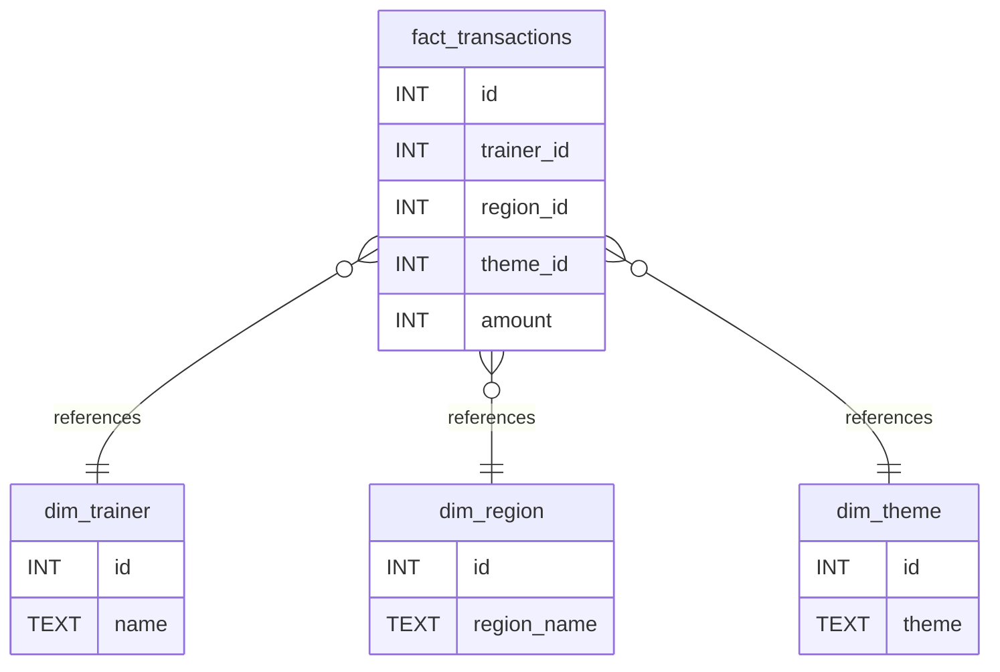

```mermaid
erDiagram
    fact_transactions {
        INT id
        INT trainer_id
        INT region_id
        INT theme_id
        INT amount
    }

    dim_trainer {
        INT id
        TEXT name
    }

    dim_region {
        INT id
        TEXT region_name
    }

    dim_theme {
        INT id
        TEXT theme
    }

    fact_transactions }o--|| dim_trainer : references
    fact_transactions }o--|| dim_region : references
    fact_transactions }o--|| dim_theme : references
```
